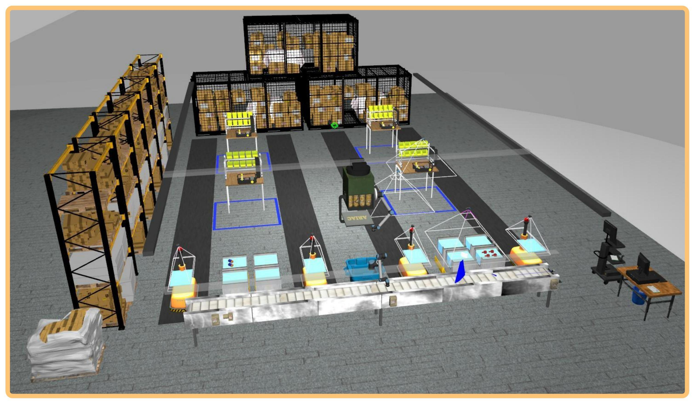

# Wiki | Home


## ARIAC 2021.



```diff
- NOTE: Always use the master branch to retrieve the latest updates.
```

```diff
- NOTE: Always review the Updates section when new code is pushed.
```
```diff
- NOTE: 'ariac_ws' is a catkin workspace that has all required packages and tools installed
```
<!----->

## [Installation](wiki/tutorials/installation.md)

- Steps to install and run ARIAC.

## [Terminology](wiki/misc/terminology.md)

- This section describes the terminology used in this wiki. If you are new to ARIAC it is strongly suggested that you visit this page first.

## [Documentation](wiki/documentation/documentation.md)

- Specifications of the NIST Agile Robotics for Industrial Automation Competition (ARIAC) and the Gazebo Environment for Agile Robotics (GEAR) software.

## [Tutorials](wiki/tutorials/tutorials.md)

- A set of tutorials to help you get started with the NIST Agile Robotics for Industrial Automation Competition (ARIAC).
## Folder Structure:

```
📦ARIAC
 ┣ 📂ariac_ws
 ┃ ┣ 📂.catkin_tools
 ┃ ┗ 📂src
 ┃ ┃ ┣ 📂ARIAC
 ┃ ┃ ┃ ┣ 📂ariac
 ┃ ┃ ┃ ┣ 📂ariac_example
 ┃ ┃ ┃ ┣ 📂gantry_moveit_config
 ┃ ┃ ┃ ┣ 📂group2_rwa4
 ┃ ┃ ┃ ┃ ┣ 📂config
 ┃ ┃ ┃ ┃ ┃ ┣ 📂trial_config
 ┃ ┃ ┃ ┃ ┃ ┃ ┣ 📜rwa2_trial.yaml
 ┃ ┃ ┃ ┃ ┃ ┃ ┣ 📜rwa3_trial.yaml
 ┃ ┃ ┃ ┃ ┃ ┃ ┣ 📜rwa4.sh
 ┃ ┃ ┃ ┃ ┃ ┃ ┗ 📜rwa4.yaml
 ┃ ┃ ┃ ┃ ┃ ┗ 📂user_config
 ┃ ┃ ┃ ┃ ┃ ┃ ┗ 📜group1_config.yaml
 ┃ ┃ ┃ ┃ ┣ 📂include
 ┃ ┃ ┃ ┃ ┃ ┣ 📜agv.h
 ┃ ┃ ┃ ┃ ┃ ┣ 📜assembly_handler.h
 ┃ ┃ ┃ ┃ ┃ ┣ 📜bins_handler.h
 ┃ ┃ ┃ ┃ ┃ ┣ 📜conveyor.h
 ┃ ┃ ┃ ┃ ┃ ┣ 📜gantry_robot.h
 ┃ ┃ ┃ ┃ ┃ ┣ 📜kitting_handler.h
 ┃ ┃ ┃ ┃ ┃ ┣ 📜kitting_robot.h
 ┃ ┃ ┃ ┃ ┃ ┣ 📜main_handler.h
 ┃ ┃ ┃ ┃ ┃ ┣ 📜order_handler.h
 ┃ ┃ ┃ ┃ ┃ ┣ 📜part_2.h
 ┃ ┃ ┃ ┃ ┃ ┣ 📜sensor_array.h
 ┃ ┃ ┃ ┃ ┃ ┗ 📜utils.h
 ┃ ┃ ┃ ┃ ┣ 📂launch
 ┃ ┃ ┃ ┃ ┃ ┗ 📜ariac.launch
 ┃ ┃ ┃ ┃ ┣ 📂msg
 ┃ ┃ ┃ ┃ ┃ ┣ 📜AgvKittingShipmentDetails.msg
 ┃ ┃ ┃ ┃ ┃ ┣ 📜AssemblyShipment.msg
 ┃ ┃ ┃ ┃ ┃ ┣ 📜FaultyPartPose.msg
 ┃ ┃ ┃ ┃ ┃ ┣ 📜IncompleteOrder.msg
 ┃ ┃ ┃ ┃ ┃ ┣ 📜KittingLocation.msg
 ┃ ┃ ┃ ┃ ┃ ┣ 📜KittingShipment.msg
 ┃ ┃ ┃ ┃ ┃ ┣ 📜Order.msg
 ┃ ┃ ┃ ┃ ┃ ┣ 📜Product.msg
 ┃ ┃ ┃ ┃ ┃ ┗ 📜Task.msg
 ┃ ┃ ┃ ┃ ┣ 📂param
 ┃ ┃ ┃ ┃ ┃ ┗ 📜flags.yaml
 ┃ ┃ ┃ ┃ ┣ 📂script
 ┃ ┃ ┃ ┃ ┃ ┗ 📜part_spawner.sh
 ┃ ┃ ┃ ┃ ┣ 📂src
 ┃ ┃ ┃ ┃ ┃ ┣ 📂nodes
 ┃ ┃ ┃ ┃ ┃ ┃ ┣ 📜agv_handler_node.cpp
 ┃ ┃ ┃ ┃ ┃ ┃ ┣ 📜assembly_handler_node.cpp
 ┃ ┃ ┃ ┃ ┃ ┃ ┣ 📜bins_handler_node.cpp
 ┃ ┃ ┃ ┃ ┃ ┃ ┣ 📜conveyor_handler_node.cpp
 ┃ ┃ ┃ ┃ ┃ ┃ ┣ 📜main_handler_node.cpp
 ┃ ┃ ┃ ┃ ┃ ┃ ┣ 📜order_handler_node.cpp
 ┃ ┃ ┃ ┃ ┃ ┃ ┣ 📜rwa4_node.cpp
 ┃ ┃ ┃ ┃ ┃ ┃ ┗ 📜sensor_array_node.cpp
 ┃ ┃ ┃ ┃ ┃ ┣ 📜agv.cpp
 ┃ ┃ ┃ ┃ ┃ ┣ 📜assembly_handler.cpp
 ┃ ┃ ┃ ┃ ┃ ┣ 📜bins_handler.cpp
 ┃ ┃ ┃ ┃ ┃ ┣ 📜conveyor.cpp
 ┃ ┃ ┃ ┃ ┃ ┣ 📜gantry_robot.cpp
 ┃ ┃ ┃ ┃ ┃ ┣ 📜kitting_handler.cpp
 ┃ ┃ ┃ ┃ ┃ ┣ 📜kitting_robot.cpp
 ┃ ┃ ┃ ┃ ┃ ┣ 📜main_handler.cpp
 ┃ ┃ ┃ ┃ ┃ ┣ 📜order_handler.cpp
 ┃ ┃ ┃ ┃ ┃ ┣ 📜part_2.cpp
 ┃ ┃ ┃ ┃ ┃ ┣ 📜sensor_array.cpp
 ┃ ┃ ┃ ┃ ┃ ┗ 📜utils.cpp
 ┃ ┃ ┃ ┃ ┣ 📂srv
 ┃ ┃ ┃ ┃ ┃ ┣ 📜agv_location.srv
 ┃ ┃ ┃ ┃ ┃ ┣ 📜assembly_part_details.srv
 ┃ ┃ ┃ ┃ ┃ ┣ 📜assembly_task.srv
 ┃ ┃ ┃ ┃ ┃ ┣ 📜check_agv_faulty_parts.srv
 ┃ ┃ ┃ ┃ ┃ ┣ 📜check_exists.srv
 ┃ ┃ ┃ ┃ ┃ ┣ 📜check_part_pose.srv
 ┃ ┃ ┃ ┃ ┃ ┣ 📜dispose_faulty_part.srv
 ┃ ┃ ┃ ┃ ┃ ┣ 📜kitting_part_details.srv
 ┃ ┃ ┃ ┃ ┃ ┣ 📜list_all_parts.srv
 ┃ ┃ ┃ ┃ ┃ ┣ 📜list_order_details.srv
 ┃ ┃ ┃ ┃ ┃ ┣ 📜order_assembly_shipment_details.srv
 ┃ ┃ ┃ ┃ ┃ ┣ 📜order_completion_status.srv
 ┃ ┃ ┃ ┃ ┃ ┣ 📜order_kitting_shipment_details.srv
 ┃ ┃ ┃ ┃ ┃ ┗ 📜order_state.srv
 ┃ ┃ ┃ ┃ ┣ 📜CMakeLists.txt
 ┃ ┃ ┃ ┃ ┗ 📜package.xml
 ┃ ┃ ┃ ┣ 📂kitting_moveit_config
 ┃ ┃ ┃ ┣ 📂motion_control
 ┃ ┃ ┃ ┣ 📂nist_gear
 ┃ ┃ ┃ ┗ 📂test_ariac
 ┃ ┃ ┗ 📂ariac-gazebo_ros_pkgs
 ┣ 📂wiki
 ┃ ┣ 📂documentation
 ┃ ┣ 📂figures
 ┃ ┣ 📂finals
 ┃ ┣ 📂misc
 ┃ ┣ 📂qualifiers
 ┃ ┗ 📂tutorials
 ┗ 📜README.md
```